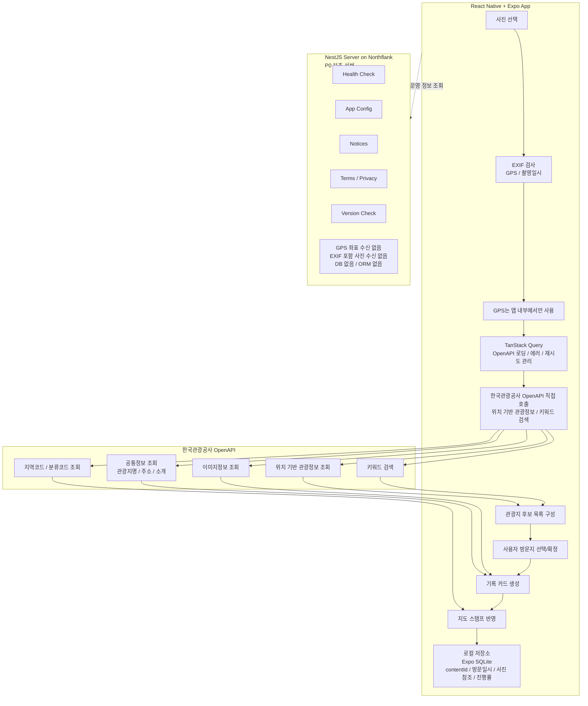

# 사진 기반 여행 기록 게이미피케이션 서비스 PRD (원본 아카이브)

> 이 문서는 분할 전 PRD 원문을 그대로 보존한 아카이브입니다.
> 주제별로 나눈 작업용 문서는 [docs/README.md](./README.md) 인덱스를 참고하세요.

| 항목      | 내용                                                                                                     |
| --------- | -------------------------------------------------------------------------------------------------------- |
| 기반 문서 | 2026 관광데이터 활용 공모전 제안서                                                                       |
| 대상 독자 | PM, 디자이너, React Native 개발자, 백엔드 개발자                                                         |
| 작성 기준 | P0 MVP 중심, P1 확장 고려                                                                                |
| 핵심 제약 | 한국관광공사 OpenAPI 실시간 호출, 관광공사 데이터 로컬 DB 저장/캐싱 서빙 지양, 사용자 GPS 서버 전송 지양 |
| 기술 방향 | React Native + Expo + TypeScript + NestJS + pnpm workspace                                               |

---

## 1. 제품 개요

### 1.1 한 줄 정의

사용자가 촬영한 여행 사진을 선택하면, 사진의 위치 정보를 앱 내부에서 확인하고 한국관광공사 OpenAPI를 실시간 호출하여 주변 관광지 후보를 찾은 뒤, 방문 기록 카드와 대한민국 여행 지도를 생성하는 모바일 앱

### 1.2 제품 비전

“사진 한 장이 곧 여행 기록이 된다.”

사용자는 여행 중 촬영한 사진을 선택하는 것만으로 방문 장소 후보를 확인하고, 한국관광공사 공공데이터와 연결된 여행 기록을 만들 수 있다.

서비스는 사용자의 여행 기록을 지도 위에 스탬프처럼 쌓아가며, 장기적으로는 AI 해설, 미션, 뱃지, 추천 기능을 통해 국내 여행의 재미와 동기를 높인다.

### 1.3 P0 핵심 가치 제안

| 가치                       | 설명                                                                                   |
| -------------------------- | -------------------------------------------------------------------------------------- |
| 사진 기반 기록             | 사용자가 찍은 사진을 여행 기록의 시작점으로 사용                                       |
| 위치 기반 관광지 후보 추천 | 사진 EXIF GPS를 앱 내부에서 확인하고, 관광공사 OpenAPI로 주변 관광지 후보 조회         |
| 사용자 확정 기반 기록      | 자동 확정이 아니라 사용자가 실제 방문지를 선택/수정하여 기록 정확도 확보               |
| 지도 스탬프                | 방문한 관광지의 지역 정보를 바탕으로 대한민국 지도에 방문 현황 표시                    |
| 공공데이터 실시간 활용     | 관광지명, 주소, 소개, 이미지, 지역/분류 정보는 관광공사 OpenAPI를 실시간 호출하여 활용 |
| 위치정보 리스크 최소화     | 사용자 GPS를 백엔드 서버로 전송하지 않고 앱 내부에서만 활용                            |

---

## 2. 배경 및 문제 정의

여행자들은 자신이 방문한 장소를 사진으로 남기지만, 촬영한 사진을 다시 정리하고 장소명, 방문일, 설명을 수동으로 입력하는 과정은 번거롭다. 그 결과 여행 사진은 갤러리에 흩어진 상태로 남고, 개인의 여행 경험이 체계적인 기록으로 이어지지 못하는 경우가 많다.

또한 한국관광공사 OpenAPI에는 관광지명, 주소, 좌표, 소개, 이미지, 지역코드, 분류코드 등 풍부한 관광 데이터가 존재하지만, 일반 사용자가 이를 직접 체감할 수 있는 서비스 경험은 제한적이다.

본 서비스는 사용자의 여행 사진과 한국관광공사 관광 데이터를 연결하여, 사진을 의미 있는 여행 기록으로 전환하는 것을 목표로 한다.

P0에서는 복잡한 AI 여행 콘텐츠보다 다음 핵심 문제 해결에 집중한다.

1. 사진에 포함된 위치 정보를 활용해 주변 관광지 후보를 쉽게 찾을 수 있는가?
2. 사용자가 후보 중 실제 방문지를 선택해 기록을 만들 수 있는가?
3. 생성된 기록이 지도 위에 쌓이며 여행 동기를 줄 수 있는가?
4. 한국관광공사 OpenAPI가 실제 사용자 플로우 안에서 실시간으로 활용되는가?
5. 사용자 GPS가 백엔드 서버로 전송되지 않는 구조를 유지할 수 있는가?

---

## 3. 목표 및 제외 목표

### 3.1 P0 목표

1. 사용자는 iOS/Android 앱에서 여행 사진을 선택할 수 있다.
2. 앱은 사진의 EXIF GPS와 촬영일시를 단말기 내부에서 확인할 수 있다.
3. 앱은 GPS 좌표를 기반으로 한국관광공사 OpenAPI를 직접 호출하여 주변 관광지 후보를 조회할 수 있다.
4. 사용자는 관광지 후보 중 실제 방문지를 선택하거나 수정할 수 있다.
5. 사용자가 확정한 관광지와 사진을 바탕으로 여행 기록 카드가 생성된다.
6. 생성된 방문 기록은 지도 스탬프 형태로 반영된다.
7. P0에서는 사용자의 GPS 좌표를 백엔드 서버로 전송하지 않는다.
8. P0에서는 관광공사 OpenAPI 데이터를 로컬 DB나 서버 DB에 저장하여 서빙하지 않는다.
9. P0에서는 서버 DB와 ORM 없이 구현한다.
10. NestJS 서버는 공지, 약관, 앱 설정, 버전 체크 등 비위치성 운영 기능에 한정한다.

### 3.2 P1 목표

1. GPS가 없는 사진에 대해 키워드 검색 또는 지역 선택 기반 기록 생성 플로우를 고도화한다.
2. 기록 수정/삭제 UX를 안정화한다.
3. 지도 화면과 지역별 진행률을 개선한다.
4. 간단한 뱃지/칭호 시스템을 로컬 계산 기반으로 제공한다.
5. AI 한 줄 해설을 선택적으로 제공한다.
6. 관광공모전 수상작 미션, 이미지 유사도, 서버 동기화는 정책 검토 후 확장한다.

### 3.3 제외 목표

#### P0 제외

- 완전 자동 이미지 인식 기반 관광지 확정
- 관광공사 OpenAPI 데이터의 로컬 DB 저장 및 자체 서빙
- 사용자 GPS 좌표의 백엔드 서버 전송
- 사용자 위치의 실시간 추적
- 서버 DB 및 ORM
- 계정 기반 기록 동기화
- 서버 저장형 방문 기록
- 대화형 AI 컨시어지
- AI 여행 일기
- 복잡한 개인화 추천 엔진
- 관광공모전 수상작 기반 미션
- 소셜 피드, 팔로우, 댓글, DM
- 숙박, 교통, 티켓 예약 및 결제
- 해외 관광지 기록

#### P1 이후 검토

- AI 한 줄 해설
- 뱃지/칭호
- 관광공모전 수상작 미션
- 이미지 유사도 기반 후보 정렬
- 공유/내보내기
- 계정 로그인
- 서버 기록 동기화
- 관리자 페이지
- PostgreSQL/Prisma 도입

---

## 4. 타겟 사용자 및 페르소나

| 페르소나           | 특징                                          | P0 핵심 니즈                                        |
| ------------------ | --------------------------------------------- | --------------------------------------------------- |
| 기록형 여행자      | 사진은 많이 찍지만 여행 기록 정리는 귀찮아함  | 사진만으로 방문 기록을 쉽게 만들고 싶음             |
| 지도 수집형 사용자 | 내가 어디를 다녀왔는지 시각적으로 보고 싶어함 | 방문 지역이 지도에 쌓이는 경험을 원함               |
| 국내 여행 탐색자   | 국내 관광지를 가볍게 기록하고 회고하고 싶어함 | 관광공사 데이터 기반의 신뢰도 있는 장소 정보를 원함 |

P0의 1차 타겟은 “기록형 여행자”로 설정한다.

지도 수집, 미션, 추천은 P1 이후 확장한다.

---

## 5. P0 핵심 사용자 시나리오

### 5.1 위치 정보가 있는 사진 기록

1. 사용자가 앱에서 여행 사진을 선택한다.
2. 앱은 사진의 EXIF에서 GPS 좌표와 촬영일시를 확인한다.
3. GPS 좌표는 앱 내부에서만 사용하고 서버로 전송하지 않는다.
4. 앱은 해당 GPS 좌표를 기준으로 한국관광공사 위치 기반 관광정보 OpenAPI를 직접 호출한다.
5. 앱은 주변 관광지 후보를 거리순으로 보여준다.
6. 사용자는 후보 중 실제 방문지를 선택한다.
7. 앱은 선택한 관광지의 contentId를 기준으로 공통정보/이미지정보/지역정보를 OpenAPI로 조회한다.
8. 앱은 사용자 사진과 관광공사 데이터를 결합하여 기록 카드를 생성한다.
9. 방문 기록은 앱 로컬 저장소에 저장된다.
10. 지도 화면에 해당 지역 방문 스탬프가 반영된다.

### 5.2 위치 정보가 없는 사진 기록

1. 사용자가 위치 정보가 없는 사진을 선택한다.
2. 앱은 “이 사진에는 위치 정보가 없습니다” 안내를 표시한다.
3. 사용자는 관광지를 직접 검색하거나 지역을 선택한다.
4. 앱은 사용자의 검색어를 기반으로 한국관광공사 OpenAPI를 호출한다.
5. 사용자는 검색 결과 중 실제 방문지를 선택한다.
6. 선택한 관광지를 기준으로 기록 카드가 생성된다.

### 5.3 관광지 후보가 없거나 불명확한 경우

1. 앱이 GPS 기준으로 주변 관광지를 조회한다.
2. 후보가 없으면 검색 반경을 확장하거나 직접 검색을 안내한다.
3. 복수 후보가 있을 경우 사용자가 직접 선택한다.
4. P0에서는 관광지를 자동 확정하지 않는다.

---

## 6. 기능 요구사항 - P0

### 6.1 사진 선택 및 EXIF 검사

사용자는 앱에서 사진을 1장 이상 선택할 수 있다.

앱은 선택된 사진에서 다음 정보를 확인한다.

- GPS 위도
- GPS 경도
- 촬영일시
- 이미지 접근 가능 여부

처리 기준은 다음과 같다.

| 조건                     | 처리                                                             |
| ------------------------ | ---------------------------------------------------------------- |
| GPS 있음 + 촬영일시 있음 | 자동 관광지 후보 조회 플로우로 이동                              |
| GPS 있음 + 촬영일시 없음 | GPS 기반 후보 조회 후 방문일은 사용자 입력 또는 현재 날짜로 보완 |
| GPS 없음 + 촬영일시 있음 | 관광지 직접 검색 플로우로 이동                                   |
| GPS 없음 + 촬영일시 없음 | 관광지 직접 검색 + 방문일 입력 플로우로 이동                     |
| 이미지 접근 실패         | 사진 선택 실패 안내                                              |

사용자 안내 문구 예시:

- “사진의 위치 정보를 확인했어요. 주변 관광지를 찾는 중입니다.”
- “이 사진에는 위치 정보가 없습니다. 관광지를 직접 선택해주세요.”
- “촬영일시를 찾을 수 없습니다. 방문 날짜를 선택해주세요.”

### 6.2 위치정보 처리 원칙

P0에서는 위치기반서비스사업자 신고 리스크를 최소화하기 위해 사용자의 GPS 좌표를 백엔드 서버로 전송하지 않는다.

위치정보 처리 원칙은 다음과 같다.

- EXIF GPS 좌표는 앱 내부에서만 사용한다.
- 관광지 후보 조회는 앱이 한국관광공사 OpenAPI를 직접 호출하여 처리한다.
- 백엔드 서버는 GPS 좌표를 수신하거나 저장하지 않는다.
- 사진 원본을 서버에 업로드하지 않는다.
- 사진 업로드가 필요한 경우, 앱에서 EXIF 위치 정보를 제거한 사본만 업로드한다.
- P0에서는 방문 기록을 앱 로컬 저장소에 저장하는 것을 기본으로 한다.
- 서버 동기화가 필요한 경우, 위치정보지원센터의 공식 사전 검토 후 범위를 결정한다.

### 6.3 한국관광공사 OpenAPI 활용 원칙

본 서비스는 공모전 FAQ 및 OpenAPI 활용 가이드에 따라 한국관광공사 OpenAPI 데이터를 로컬 DB 또는 서버 DB에 저장하거나 캐싱하여 서빙하지 않는다.

P0에서는 다음 원칙을 따른다.

- 관광지 후보 조회는 한국관광공사 OpenAPI를 실시간 호출한다.
- 관광지 상세 정보는 화면 표시 시 OpenAPI를 호출하여 조회한다.
- 관광지명, 주소, 소개, 대표 이미지, 지역/분류 정보 등 관광공사 원천 데이터는 저장하지 않는다.
- 사용자 기록에는 관광공사 contentId와 사용자가 확정한 기록 정보만 저장한다.
- OpenAPI 호출 이력이 남도록 실제 사용자 플로우에서 API를 호출한다.
- API 인증키 관리 방식은 별도 기술 검토가 필요하다.

P0에서 활용할 API 범위:

| OpenAPI             | P0 활용                                |
| ------------------- | -------------------------------------- |
| 위치 기반 관광정보  | GPS 좌표 기준 주변 관광지 후보 조회    |
| 키워드 검색         | GPS 없는 사진의 관광지 직접 검색       |
| 공통정보 조회       | 관광지명, 주소, 소개 등 상세 정보 표시 |
| 이미지정보 조회     | 기록 카드 대표 이미지 표시             |
| 지역코드 / 분류코드 | 지도 스탬프 및 관광 유형 표시          |

### 6.4 관광지 후보 조회

사진 GPS 좌표를 기준으로 한국관광공사 위치 기반 관광정보 OpenAPI를 호출한다.

기본 조회 기준:

- 기본 반경: 300m
- 후보가 없는 경우: 1km까지 확장
- 1km 내 후보가 없는 경우: 직접 검색 플로우로 이동
- 후보 최대 노출 개수: 5개
- 기본 정렬: 거리순

후보 목록에는 다음 정보를 표시한다.

- 관광지명
- 주소
- 거리
- 관광 유형
- 대표 이미지
- 지역명

단, 위 정보는 저장하지 않고 화면 표시용으로만 사용한다.

매칭 신뢰도는 다음 기준으로 표시한다.

| 신뢰도    | 기준                           |
| --------- | ------------------------------ |
| 높음      | 100m 이내 단일 후보            |
| 보통      | 300m 이내 복수 후보            |
| 낮음      | 300m 초과 1km 이내 후보        |
| 수동 필요 | GPS 없음 또는 1km 내 후보 없음 |

P0에서는 관광지를 자동 확정하지 않고, 사용자가 반드시 최종 방문지를 확인하거나 선택한다.

### 6.5 방문지 확정

사용자는 시스템이 제안한 후보 관광지 중 하나를 선택할 수 있다.

사용자는 다음 행동을 할 수 있다.

- 후보 관광지 선택
- 관광지명 검색
- 지역 기준 검색
- “해당 없음” 선택 후 다시 검색

방문지 확정 시 로컬 저장소에 다음 데이터를 저장한다.

- 로컬 기록 ID
- 사진 로컬 참조
- 관광공사 contentId
- 방문일시
- 지역코드
- 시군구코드, 선택
- 관광 유형 코드, 선택
- 매칭 방식
- 매칭 신뢰도
- 사용자 확정 여부
- 생성일시

매칭 방식 값:

- GPS_CANDIDATE
- MANUAL_SEARCH
- MANUAL_REGION_SELECT

P0에서는 contentId와 사용자 기록 정보를 저장하되, 관광공사 원천 데이터 전체를 로컬 DB에 저장하지 않는다.

### 6.6 여행 기록 카드 생성

방문지가 확정되면 기본 여행 기록 카드를 생성한다.

기록 카드 필수 표시 정보:

- 사용자 사진
- 관광지명
- 주소
- 방문일시
- 지역
- 관광 유형
- 대표 이미지
- 관광지 간단 소개

단, 관광지명, 주소, 소개, 대표 이미지 등은 로컬 저장 데이터가 아니라 화면 표시 시 한국관광공사 OpenAPI를 호출하여 조회한다.

기록 카드 생성 흐름:

1. 사용자가 관광지를 확정한다.
2. 앱은 contentId를 로컬 기록에 저장한다.
3. 기록 카드 화면 진입 시 contentId 기반으로 공통정보/이미지정보 OpenAPI를 호출한다.
4. OpenAPI 응답 데이터를 사용자 사진과 결합하여 카드 UI에 표시한다.

P0에서는 기록 카드 생성이 AI 해설 생성에 의존하지 않는다.

### 6.7 방문 기록 Flow

#### 기록 생성 Flow

1. 사용자가 사진을 선택한다.
2. 앱은 사진의 EXIF에서 GPS와 촬영일시를 확인한다.
3. GPS가 있는 경우, 앱은 GPS 좌표를 서버로 전송하지 않고 앱 내부에서만 사용한다.
4. 앱은 한국관광공사 OpenAPI를 직접 호출하여 주변 관광지 후보를 조회한다.
5. 사용자는 후보 관광지 중 실제 방문지를 선택한다.
6. 앱은 선택된 관광지의 contentId와 방문일시를 기준으로 로컬 방문 기록을 생성한다.
7. 앱은 contentId를 기반으로 관광공사 OpenAPI를 호출하여 관광지명, 주소, 이미지, 소개 정보를 화면에 표시한다.
8. 기록 생성 완료 후 지도 스탬프에 해당 지역 방문 현황을 반영한다.

#### 기록 조회 Flow

1. 사용자가 기록 카드 또는 기록 목록에서 기존 기록을 연다.
2. 앱은 로컬 저장소에서 contentId, 방문일시, 사진 참조 정보를 조회한다.
3. 앱은 contentId를 기준으로 한국관광공사 OpenAPI를 호출한다.
4. OpenAPI 응답으로 관광지명, 주소, 소개, 이미지 정보를 받아온다.
5. 앱은 로컬 사진과 OpenAPI 응답 데이터를 조합하여 기록 카드를 표시한다.
6. OpenAPI 호출 실패 시 오류 안내와 재시도 버튼을 제공한다.

#### 기록 수정 Flow

P0에서 수정 가능한 항목은 최소화한다.

수정 가능 항목:

- 방문일시
- 연결된 관광지 contentId
- 사용자 메모, 선택

수정 Flow:

1. 사용자가 기록 카드에서 수정 버튼을 누른다.
2. 관광지 변경이 필요한 경우 키워드 검색 또는 주변 관광지 재검색을 수행한다.
3. 사용자가 새 관광지를 선택하면 기존 contentId를 새 contentId로 교체한다.
4. 지도 스탬프와 지역 방문 현황을 다시 계산한다.

#### 기록 삭제 Flow

1. 사용자가 기록 카드에서 삭제를 선택한다.
2. 앱은 삭제 확인 안내를 표시한다.
3. 사용자가 확인하면 로컬 방문 기록을 삭제한다.
4. 연결된 로컬 사진 참조를 제거한다.
5. 해당 기록이 지역 방문 현황에 반영되어 있었다면 지도 스탬프를 다시 계산한다.
6. 삭제된 기록은 복구하지 않는다.

### 6.8 지도 스탬프

방문 기록이 생성되면 해당 관광지의 지역 정보를 기준으로 지도에 방문 여부를 반영한다.

P0 지도 기능:

- 시·도 단위 방문 표시
- 방문한 지역 수 표시
- 전체 지역 대비 진행률 표시
- 최근 방문 기록 3개 표시

지도 표시 예시:

- 방문 지역: 3/17
- 기록한 관광지: 8곳
- 최근 기록: 경복궁, 남산서울타워, 해운대해수욕장

지도 스탬프 갱신 Flow:

1. 방문 기록이 생성, 수정, 삭제될 때마다 로컬 기록 목록을 기준으로 지역별 방문 수를 다시 계산한다.
2. areaCode 기준으로 시·도 방문 여부를 판단한다.
3. 방문 수가 1개 이상인 지역은 방문 완료 상태로 표시한다.
4. 방문 수가 0개가 된 지역은 미방문 상태로 되돌린다.

P0에서는 시·군·구 단위 상세 달성률, 관광 유형별 달성률, 뱃지/칭호는 필수로 구현하지 않는다.

### 6.9 AI 해설

P0에서는 AI 해설을 필수 기능으로 두지 않는다.

P1에서 선택적으로 구현할 경우 다음 원칙을 따른다.

- AI 한 줄 해설만 제공한다.
- AI 해설은 기록 카드 생성 이후 수동 요청 또는 비동기 방식으로 생성한다.
- AI 해설 생성 실패가 기록 카드 생성 실패로 이어지지 않는다.
- 관광공사 OpenAPI에서 조회한 관광지 정보를 근거로만 생성한다.
- P1에서도 AI 여행 일기, 대화형 AI 컨시어지, 추천 미션 생성을 기본 범위에 포함하지 않는다.

### 6.10 이미지 유사도 분석

P0에서는 이미지 유사도 분석을 제외한다.

제외 사유:

- 관광공사 이미지 데이터를 수집하거나 임베딩화하여 저장할 경우, OpenAPI 데이터 로컬 저장 및 가공 이슈가 발생할 수 있다.
- 이미지 유사도만으로 관광지를 확정할 경우 정확도 리스크가 있다.
- P0의 핵심은 GPS 기반 OpenAPI 실시간 호출과 사용자 확정 기반 기록 생성이다.

P1 이후 정책 확인 후 다음 방식으로 검토할 수 있다.

- 이미지 유사도는 자동 확정이 아니라 후보 정렬 보조로만 사용
- 관광공사 데이터 저장/가공 가능 여부를 사전 문의 후 적용
- 별도 신청이 필요한 경우 공모전 운영 측에 문의

---

## 7. 기능 요구사항 - P1

### 7.1 기록 UX 개선

- 기록 목록 화면 추가
- 날짜별 기록 그룹화
- 방문 지역 필터
- 관광 유형 필터
- 기록 수정/삭제 UX 개선
- 사용자 메모 추가

### 7.2 뱃지/칭호

P1에서는 로컬 기록 기반의 간단한 뱃지/칭호를 제공한다.

예시:

| 조건                    | 뱃지/칭호        |
| ----------------------- | ---------------- |
| 첫 기록 생성            | 첫 발자국        |
| 관광지 5개 기록         | 여행 기록가      |
| 시·도 3개 이상 방문     | 작은 지도 수집가 |
| 같은 지역 3회 이상 기록 | 지역 탐험가      |

P1 뱃지/칭호는 서버 저장 없이 로컬 기록 기반으로 계산한다.

### 7.3 추천

P1에서는 복잡한 개인화 추천 엔진을 구현하지 않는다.

대신 다음 수준의 단순 추천을 제공한다.

- 아직 방문하지 않은 시·도 표시
- 최근 기록한 지역과 다른 지역 제안
- 키워드 검색 기반 관광지 탐색
- 관광 유형별 탐색

### 7.4 AI 한 줄 해설

P1에서 AI 한 줄 해설을 선택적으로 제공한다.

- 사용자가 기록 카드에서 “AI 해설 생성”을 누르면 실행한다.
- 관광공사 OpenAPI에서 조회한 공통정보를 기반으로 생성한다.
- 생성 결과는 사용자가 원할 경우 로컬 기록에 저장할 수 있다.
- AI 해설은 사실 정보가 아니라 감성적 보조 문구로 표시한다.

### 7.5 관광공모전 수상작 미션

P1 후보 기능으로 둔다.

단, 다음 조건 확인 후 진행한다.

- 관광공모전 수상작 API 실시간 호출 가능 여부
- 수상작 이미지/촬영지 데이터 저장 가능 여부
- 미션 판정에 필요한 위치정보 처리 방식
- 관광공사 OpenAPI 데이터 가공/저장 정책

P1에서 구현한다면 다음 수준으로 제한한다.

- 앱에서 수상작 정보를 실시간 호출
- 수상작 촬영지 목록을 화면 표시
- 사용자가 직접 미션 완료 처리
- 자동 위치 판정은 제외하거나 별도 검토

---

## 8. 화면 정의

### 8.1 홈/지도 화면

목적: 사용자가 자신의 방문 현황을 확인한다.

주요 구성:

- 대한민국 지도
- 방문한 시·도 표시
- 방문 지역 수
- 기록한 관광지 수
- 최근 기록 카드 목록
- 사진 기록 시작 버튼

필수 상태:

- 방문 기록 없음
- 방문 기록 있음
- 지도 데이터 로딩 중
- 지도 데이터 로딩 실패

### 8.2 사진 선택 화면

목적: 사용자가 여행 사진을 선택하고 기록 생성을 시작한다.

주요 구성:

- 사진 선택 버튼
- 선택한 사진 미리보기
- EXIF 검사 상태
- 위치 정보 없는 사진 안내
- 촬영일시 없는 사진 안내

필수 상태:

- 사진 미선택
- 사진 선택 완료
- EXIF 검사 중
- GPS 확인 완료
- GPS 없음
- 사진 접근 실패

### 8.3 관광지 후보 선택 화면

목적: 사용자가 사진과 연결할 실제 관광지를 확정한다.

주요 구성:

- 사용자 사진 미리보기
- 주변 관광지 후보 목록
- 관광지명
- 거리
- 주소
- 대표 이미지
- 매칭 신뢰도
- 직접 검색 버튼

필수 상태:

- OpenAPI 호출 중
- 후보 있음
- 후보 없음
- OpenAPI 호출 실패
- 직접 검색 중
- 관광지 선택 완료

### 8.4 기록 카드 상세 화면

목적: 생성된 여행 기록을 확인한다.

주요 구성:

- 사용자 사진
- 관광지명
- 방문일시
- 주소
- 지역
- 관광 유형
- 관광지 소개
- 대표 이미지
- 삭제 버튼
- 수정 버튼

필수 상태:

- 카드 로딩 중
- 카드 표시 완료
- OpenAPI 상세 정보 조회 실패
- 기록 삭제 완료

### 8.5 기록 목록 화면

목적: 사용자가 생성한 방문 기록을 다시 확인한다.

P0에서는 최근 기록 목록 수준으로 제공하고, P1에서 필터와 그룹화를 추가한다.

주요 구성:

- 최근 기록 목록
- 방문일
- 관광지명
- 지역
- 사진 썸네일

### 8.6 설정 화면

목적: 사용자가 위치 정보, 사진, 기록 저장 관련 설정을 확인한다.

주요 구성:

- 위치 정보 활용 안내
- EXIF 사용 안내
- 기록 데이터 삭제
- 전체 기록 초기화
- 개인정보 처리 안내
- 약관/개인정보 처리방침 링크

---

## 9. 시스템 아키텍처 및 데이터 흐름



---

## 10. 기술 스택

### 10.1 Monorepo

| 항목                | 선택                      |
| ------------------- | ------------------------- |
| Package Manager     | pnpm workspace            |
| Build Orchestration | P0에서는 Turborepo 미사용 |
| Language            | TypeScript                |
| Shared Package      | 공통 타입, 상수, 스키마   |

P0에서는 pnpm workspace만 사용한다. Turborepo는 패키지 수가 늘어나고, 빌드/테스트 캐싱 및 태스크 오케스트레이션이 필요해지는 시점에 도입을 검토한다.

### 10.2 Mobile App

| 항목            | 선택                                                                    |
| --------------- | ----------------------------------------------------------------------- |
| Framework       | React Native                                                            |
| Runtime/Tooling | Expo                                                                    |
| Routing         | Expo Router                                                             |
| Language        | TypeScript                                                              |
| API State       | TanStack Query                                                          |
| Local Storage   | Expo SQLite                                                             |
| Client State    | Zustand, 선택                                                           |
| Map UI          | 추후 라이브러리 선정                                                    |
| EXIF 처리       | React Native/Expo 환경에서 사용 가능한 이미지 메타데이터 접근 방식 검토 |

역할 구분:

| 도구           | 역할                                                     |
| -------------- | -------------------------------------------------------- |
| React Native   | 앱 UI 구현                                               |
| Expo           | iOS/Android 개발 및 배포 편의성                          |
| Expo Router    | 화면 라우팅                                              |
| TanStack Query | 관광공사 OpenAPI 호출의 loading/error/retry/refetch 관리 |
| Expo SQLite    | 사용자 방문 기록 로컬 저장                               |
| Zustand        | 선택된 사진, 임시 작성 상태 등 클라이언트 상태 관리      |

주의:

- TanStack Query의 캐시는 UI 상태 관리를 위한 메모리성 캐시로 사용한다.
- 관광공사 데이터를 로컬 DB에 저장하거나 영구 캐싱하지 않는다.

### 10.3 Backend

| 항목      | 선택                         |
| --------- | ---------------------------- |
| Framework | NestJS                       |
| Runtime   | Node.js LTS                  |
| Deploy    | Northflank                   |
| DB        | P0 없음                      |
| ORM       | P0 없음                      |
| API Docs  | Swagger/OpenAPI 문서화, 선택 |
| Container | Dockerfile 기반 배포         |

NestJS 서버는 P0 핵심 기록 플로우에 관여하지 않는다.

P0 서버 역할:

- Health Check
- App Config
- Notices
- Terms/Privacy
- Version Check
- 비위치성 오류 로그, 선택

P0 서버가 하지 않는 일:

- 사용자 GPS 좌표 수신
- EXIF 포함 사진 수신
- 사용자 방문 장소 저장
- 관광지 후보 매칭
- 관광공사 OpenAPI 데이터 저장/캐싱 서빙
- 관광공사 API 프록시, P0에서는 제외

### 10.4 P1 이후 서버 확장 후보

P1 후반 또는 P2에서 다음 기능이 필요하면 서버 DB와 ORM을 검토한다.

- 계정 로그인
- 기기 간 기록 동기화
- 공유 링크
- 서버 저장형 기록 백업
- 관리자 페이지
- 서버 기반 AI 해설 저장
- 사용자별 통계 저장

이 경우 후보 스택:

| 항목   | 후보                            |
| ------ | ------------------------------- |
| DB     | PostgreSQL                      |
| ORM    | Prisma                          |
| Server | NestJS 유지                     |
| Deploy | Northflank 또는 Managed DB 연동 |

단, 사용자별 방문 장소 기록을 서버에 저장하는 경우 위치정보지원센터 공식 사전 검토 후 진행한다.

---

## 11. 모노레포 구조

```txt
travel-stamp/
  apps/
    mobile/
      app/
        index.tsx
        record/
          select-photo.tsx
          candidates.tsx
          [id].tsx
        map.tsx
        settings.tsx
      src/
        features/
          record/
          map/
          settings/
        lib/
          kto/
          storage/
          query/
        components/
    api/
      src/
        health/
        app-config/
        notices/
        legal/
        version/
        main.ts
  packages/
    shared/
      src/
        types/
        constants/
        schemas/
    config/
      tsconfig/
      eslint/
  package.json
  pnpm-workspace.yaml
```

### 11.1 packages/shared

공유 패키지에는 다음 항목을 둔다.

- MatchMethod
- MatchConfidence
- VisitRecord type
- RegionCode type
- KTO API 응답 파싱용 타입 일부
- Zod schema, 선택
- 공통 상수

주의:

- 관광공사 OpenAPI 응답 전문을 저장하기 위한 모델을 만들지 않는다.
- 앱에서 응답을 파싱하고 화면에 표시하기 위한 타입만 정의한다.

---

## 12. 데이터 저장 정책

### 12.1 로컬 저장 대상

P0에서는 방문 기록을 앱 로컬 저장소에 저장한다.

저장 가능한 데이터:

- 로컬 사용자 식별자
- 사진 로컬 참조
- 관광공사 contentId
- 방문일시
- 지역코드
- 시군구코드, 선택
- 관광 유형 코드, 선택
- 매칭 방식
- 매칭 신뢰도
- 사용자 확정 여부
- 지도 진행률
- 사용자가 작성한 메모

### 12.2 저장하지 않는 데이터

P0에서는 다음 데이터를 로컬 DB 또는 서버 DB에 원천 데이터로 저장하지 않는다.

- 관광지명
- 주소
- 관광지 소개
- 대표 이미지 URL
- 관광공사 OpenAPI 응답 전문
- 관광지 목록 데이터
- 관광사진 데이터
- 지역코드 전체 목록
- 분류코드 전체 목록
- GPS 위도/경도, 기본 저장하지 않음

단, 화면 표시를 위해 OpenAPI 응답을 메모리에서 일시적으로 사용하는 것은 가능하다.

### 12.3 서버 저장 정책

P0에서는 서버 저장을 최소화한다.

서버가 필요한 경우에도 다음 원칙을 따른다.

- GPS 좌표를 서버로 전송하지 않는다.
- EXIF가 포함된 원본 사진을 서버로 업로드하지 않는다.
- 사용자의 방문 장소 기록을 서버에 저장하지 않는다.
- 비위치성 앱 설정, 공지, 약관 데이터만 서버에서 제공한다.

---

## 13. 최소 로컬 데이터 모델

### LocalPhoto

| 필드           | 설명                    |
| -------------- | ----------------------- |
| id             | 로컬 사진 ID            |
| local_asset_id | 사진 라이브러리 참조 ID |
| taken_at       | 촬영일시                |
| has_gps        | GPS 존재 여부           |
| created_at     | 기록 생성일시           |

주의: GPS 위도/경도는 P0에서 저장하지 않는 것을 기본으로 한다. 필요한 경우 앱 내부 임시 메모리에서만 사용한다.

### VisitRecord

| 필드             | 설명                 |
| ---------------- | -------------------- |
| id               | 로컬 방문 기록 ID    |
| local_photo_id   | 연결된 사진 ID       |
| content_id       | 관광공사 contentId   |
| visited_at       | 방문일시             |
| area_code        | 관광공사 지역코드    |
| sigungu_code     | 시군구코드, 선택     |
| category_code    | 관광 유형 코드, 선택 |
| match_method     | 매칭 방식            |
| match_confidence | 매칭 신뢰도          |
| user_confirmed   | 사용자 확정 여부     |
| created_at       | 생성일시             |
| updated_at       | 수정일시             |
| deleted_at       | 삭제일시             |

### RegionProgress

| 필드             | 설명                   |
| ---------------- | ---------------------- |
| id               | 로컬 진행률 ID         |
| area_code        | 관광공사 지역코드      |
| visit_count      | 해당 지역 방문 기록 수 |
| first_visited_at | 최초 방문일            |
| last_visited_at  | 최근 방문일            |

### UserMemo

| 필드            | 설명             |
| --------------- | ---------------- |
| id              | 메모 ID          |
| visit_record_id | 방문 기록 ID     |
| memo            | 사용자 작성 메모 |
| created_at      | 생성일시         |
| updated_at      | 수정일시         |

### BadgeProgress, P1

| 필드      | 설명           |
| --------- | -------------- |
| id        | 뱃지 진행률 ID |
| badge_key | 뱃지 식별자    |
| earned    | 획득 여부      |
| earned_at | 획득일시       |

---

## 14. API 역할 정의

### 14.1 앱에서 직접 호출하는 한국관광공사 OpenAPI

| 목적                           | 호출 방식                       |
| ------------------------------ | ------------------------------- |
| GPS 기반 주변 관광지 후보 조회 | 위치 기반 관광정보 OpenAPI 호출 |
| GPS 없는 사진의 관광지 검색    | 키워드 검색 OpenAPI 호출        |
| 관광지 상세 정보 표시          | contentId 기반 공통정보 조회    |
| 기록 카드 대표 이미지 표시     | 이미지정보 조회                 |
| 지도 스탬프 반영               | 지역코드 / 분류코드 정보 활용   |

### 14.2 NestJS 서버 API

P0에서는 백엔드 API를 비위치성 운영 기능에 한정한다.

예상 API 역할:

| API                | 역할                   |
| ------------------ | ---------------------- |
| GET /health        | 서버 상태 확인         |
| GET /app-config    | 앱 설정값 조회         |
| GET /notices       | 공지사항 조회          |
| GET /legal/terms   | 이용약관 조회          |
| GET /legal/privacy | 개인정보 처리방침 조회 |
| GET /version       | 앱 최소 지원 버전 조회 |

P0 서버는 다음 데이터를 수신하지 않는다.

- 사용자 GPS 좌표
- EXIF가 포함된 원본 사진
- 사용자의 실시간 위치 정보
- 사용자의 방문 장소 기록

---

## 15. 성능 및 UX 목표

### 15.1 성능 목표

| 항목                       | 목표                        |
| -------------------------- | --------------------------- |
| 사진 EXIF 검사             | P95 1초 이하                |
| 관광공사 OpenAPI 후보 조회 | P95 5초 이하                |
| 후보 목록 표시             | OpenAPI 응답 후 즉시        |
| 기록 카드 생성             | 방문지 확정 후 P95 3초 이하 |
| 지도 스탬프 반영           | 기록 생성 후 P95 1초 이하   |
| NestJS 운영 API 응답       | P95 1초 이하                |

### 15.2 OpenAPI 지연 대응

OpenAPI 호출이 지연되거나 실패할 경우 다음 UX를 제공한다.

- 로딩 상태 표시
- 재시도 버튼 제공
- 직접 검색 플로우 제공
- 일시적 오류 안내
- 기록 생성 중단 없이 사진 선택 상태 유지

오류 문구 예시:

- “관광지 정보를 불러오지 못했습니다. 다시 시도해주세요.”
- “주변 관광지를 찾지 못했습니다. 관광지를 직접 검색해보세요.”
- “현재 관광공사 API 응답이 지연되고 있습니다.”

---

## 16. 개인정보 및 위치정보 정책

P0에서는 위치정보 리스크를 줄이기 위해 다음 원칙을 따른다.

1. 사용자의 GPS 좌표는 앱 내부에서만 사용한다.
2. GPS 좌표는 백엔드 서버로 전송하지 않는다.
3. GPS 좌표는 로컬 DB에 기본 저장하지 않는다.
4. 관광지 후보 조회는 앱이 한국관광공사 OpenAPI를 직접 호출한다.
5. 사진 원본을 서버에 업로드하지 않는다.
6. 서버 업로드가 필요한 경우 EXIF 위치 정보를 제거한 사본만 업로드한다.
7. 사용자는 개별 방문 기록을 삭제할 수 있다.
8. 사용자는 전체 로컬 기록을 초기화할 수 있다.
9. 서버 동기화 또는 사용자별 장소 기록 저장이 필요한 경우 위치정보지원센터 공식 사전 검토 후 진행한다.

최초 실행 시 안내해야 할 내용:

- 사진 접근 권한 사용 목적
- EXIF 위치 정보 사용 목적
- GPS 정보가 앱 내부에서 관광지 후보 조회에 사용된다는 점
- GPS 정보가 백엔드 서버로 전송되지 않는다는 점
- 기록 삭제 방법

---

## 17. 리스크 및 대응

| 리스크                                          | 영향                          | 대응                                                   |
| ----------------------------------------------- | ----------------------------- | ------------------------------------------------------ |
| EXIF GPS가 없는 사진이 많음                     | 자동 후보 추천 경험 약화      | 직접 검색/지역 선택 플로우 제공                        |
| 관광공사 OpenAPI 실시간 호출 지연               | 후보 조회 지연                | 로딩, 재시도, 직접 검색 제공                           |
| OpenAPI 장애                                    | 기록 카드 상세 정보 표시 실패 | 오류 안내 및 재시도 제공                               |
| API 인증키가 앱에 포함될 수 있음                | 키 노출 가능성                | 키 제한 정책, 호출량 모니터링, 별도 기술 검토          |
| GPS 서버 전송 시 위치기반서비스사업 신고 리스크 | 법적/심사 리스크              | P0에서는 GPS 서버 전송 금지                            |
| 사진 원본 EXIF에 위치 정보 포함                 | 위치정보 서버 전송 리스크     | 서버 업로드 금지 또는 EXIF 제거                        |
| 관광공사 데이터 로컬 저장 이슈                  | 심사 불이익 가능성            | OpenAPI 실시간 호출 방식 유지                          |
| 이미지 유사도 데이터 저장 이슈                  | 정책 위반 가능성              | P0 제외, P1 이후 별도 문의                             |
| 완전 자동 매칭 실패                             | 잘못된 기록 생성              | 사용자 최종 확정 방식 사용                             |
| 서버 DB 부재                                    | 기기 간 동기화 불가           | P0에서는 로컬 저장으로 제한, P1/P2에서 검토            |
| NestJS 서버 역할 과소                           | 서버가 과해 보일 수 있음      | 포트폴리오 관점에서 운영 API와 lifecycle 관리로 명확화 |

---

## 18. 릴리스 계획

### M1 - P0 핵심 기록 루프

목표: 사진 위치 기반 관광지 후보 조회와 기록 카드 생성을 검증한다.

포함 기능:

- 사진 선택
- EXIF GPS/촬영일시 검사
- 앱에서 관광공사 OpenAPI 직접 호출
- 주변 관광지 후보 표시
- 사용자 방문지 확정
- 기록 카드 생성
- 로컬 방문 기록 저장
- 지도 스탬프 반영
- 기록 삭제
- NestJS health/app-config API

### M2 - P0 안정화

목표: 실패 케이스와 UX 완성도를 높인다.

포함 기능:

- GPS 없는 사진 직접 검색
- OpenAPI 실패/지연 대응
- 촬영일시 없는 사진 보완
- 지도 화면 개선
- 기록 카드 상세 개선
- 개인정보/위치정보 안내 강화
- NestJS 공지/약관/버전 체크 API

### M3 - P1 확장

목표: 기록 지속 사용 동기를 강화한다.

후보 기능:

- 기록 목록
- 기록 수정
- 사용자 메모
- 간단한 뱃지/칭호
- 미방문 지역 표시
- AI 한 줄 해설, 선택

### M4 - P1 이후 검토

목표: 공모전 제출 또는 테스트 이후 확장 기능을 검토한다.

후보 기능:

- 관광공모전 수상작 미션
- 다음 여행지 추천
- 이미지 유사도 기반 후보 정렬
- 공유/내보내기
- 서버 동기화
- 계정 로그인
- PostgreSQL/Prisma 도입

단, M4 기능 중 이미지 유사도, 서버 동기화, 관광공사 데이터 가공 저장이 필요한 기능은 공모전 운영 측 또는 위치정보지원센터에 사전 검토 후 진행한다.

---

## 19. P0 완료 기준

P0는 다음 조건을 만족하면 완료로 본다.

- 사용자는 앱에서 여행 사진을 선택할 수 있다.
- 앱은 사진의 EXIF GPS와 촬영일시를 확인할 수 있다.
- GPS 좌표는 서버로 전송되지 않는다.
- 앱은 GPS 좌표를 기준으로 한국관광공사 OpenAPI를 실시간 호출할 수 있다.
- 앱은 주변 관광지 후보를 사용자에게 표시할 수 있다.
- 사용자는 후보 중 실제 방문지를 선택하거나 직접 검색할 수 있다.
- 사용자가 확정한 관광지를 기준으로 기록 카드가 생성된다.
- 기록 카드에는 사용자 사진과 관광공사 OpenAPI에서 조회한 관광지 정보가 표시된다.
- 방문 기록은 로컬 저장소에 저장된다.
- 방문 기록은 지도 스탬프에 반영된다.
- GPS가 없는 사진은 직접 검색 플로우로 처리된다.
- OpenAPI 호출 실패 시 재시도 또는 직접 검색 플로우를 제공한다.
- 사용자는 개별 기록을 삭제할 수 있다.
- 관광공사 OpenAPI 데이터는 로컬 DB 또는 서버 DB에 원천 저장하거나 캐싱하여 서빙하지 않는다.
- NestJS 서버는 비위치성 운영 API만 제공한다.
- P0에서는 서버 DB와 ORM을 사용하지 않는다.

---

## 20. 핵심 설계 원칙 요약

1. 관광공사 OpenAPI는 실제 사용자 플로우에서 실시간 호출한다.
2. 관광공사 원천 데이터는 로컬 DB 또는 서버 DB에 저장하지 않는다.
3. 사용자 GPS 좌표는 백엔드 서버로 전송하지 않는다.
4. EXIF GPS는 앱 내부에서 관광지 후보 조회에만 사용한다.
5. 방문 기록은 contentId와 사용자 확정 정보 중심으로 로컬 저장한다.
6. 관광지를 자동 확정하지 않고 사용자가 최종 확정한다.
7. P0에서는 지도 스탬프와 기록 카드 생성에 집중한다.
8. 서버는 NestJS로 구성하되 비위치성 운영 기능에 한정한다.
9. P0에서는 DB와 ORM을 사용하지 않는다.
10. P1에서는 로컬 기록 기반 뱃지/칭호와 기록 UX 개선을 우선한다.
11. AI, 이미지 유사도, 수상작 미션, 서버 동기화는 정책 검토 후 확장한다.

---

## 21. 포트폴리오 관점 기술 의사결정 요약

1. 위치정보 리스크를 줄이기 위해 GPS 서버 전송을 제거했다.
2. 관광공사 OpenAPI 검증 요건에 맞춰 앱에서 실시간 호출하도록 설계했다.
3. 서버는 NestJS 기반 비위치성 운영 API로 제한했다.
4. 로컬 기록은 contentId 중심으로 저장하고, 관광지 상세는 조회 시점에 OpenAPI로 재호출했다.
5. TanStack Query로 OpenAPI 호출의 loading/error/retry lifecycle을 관리했다.
6. Expo SQLite로 서버 DB 없이 로컬 방문 기록을 관리했다.
7. pnpm workspace로 TypeScript 기반 모바일/서버 모노레포를 구성했다.
8. P0에서는 DB/ORM을 제외하고, P1/P2에서 필요할 때 PostgreSQL/Prisma를 도입할 수 있도록 확장성을 남겼다.
