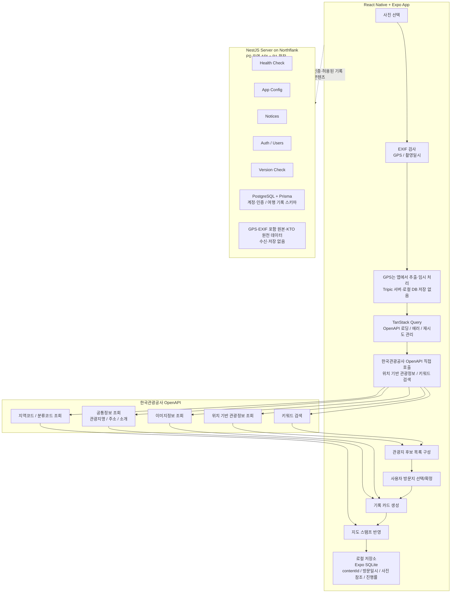

# 06. 시스템 아키텍처 · 기술 스택 · 모노레포 구조 (PRD 9~11장)

> 원문: [00-prd-full.md](./00-prd-full.md) · 인덱스: [README.md](./README.md)

## 9. 시스템 아키텍처 및 데이터 흐름



## 10. 기술 스택

### 10.1 Monorepo

| 항목                | 선택                      |
| ------------------- | ------------------------- |
| Package Manager     | pnpm workspace            |
| Build Orchestration | P0에서는 Turborepo 미사용 |
| Language            | TypeScript                |
| Shared Package      | 공통 타입·상수·스키마     |

P0에서는 pnpm workspace만 사용. Turborepo는 패키지/캐싱 필요 시점에 도입 검토.

### 10.2 Mobile App

| 항목            | 선택                                           |
| --------------- | ---------------------------------------------- |
| Framework       | React Native                                   |
| Runtime/Tooling | Expo                                           |
| Routing         | Expo Router                                    |
| Architecture    | Feature-Sliced Design(FSD)                     |
| Language        | TypeScript                                     |
| API State       | TanStack Query                                 |
| Local Storage   | Expo SQLite                                    |
| Client State    | React Context(기록 생성 중 임시 상태)          |
| Map UI          | react-native-svg                               |
| EXIF 처리       | expo-image-picker의 이미지 메타데이터 접근 기능 |

주의: TanStack Query 캐시는 UI용 메모리 캐시로만 사용하고 관광공사 데이터를 영구 캐싱/저장하지 않는다.

### 10.3 Backend

| 항목      | 선택                                                       |
| --------- | ---------------------------------------------------------- |
| Framework | NestJS                                                     |
| Runtime   | Node.js LTS                                                |
| Deploy    | Northflank                                                 |
| DB        | P0 없음 → P1: PostgreSQL (계정/인증 + 여행 기록 스키마)    |
| ORM       | P0 없음 → P1: Prisma (방문 관광지 API만 사전 검토 후 노출) |
| API Docs  | Swagger/OpenAPI (선택)                                     |
| Container | Dockerfile 기반 배포                                       |

P0 서버 역할: Health Check, App Config, Notices, Version Check, 비위치성 오류 로그(선택).
P0 서버가 하지 않는 일: GPS 좌표 수신, EXIF 포함 사진 수신, 방문 장소 저장, 후보 매칭, OpenAPI 데이터 저장/캐싱 서빙, OpenAPI 프록시(P0 제외).

### 10.4 P1 이후 서버 확장

계정 로그인, 기기 간 동기화, 공유 링크, 서버 백업, 관리자 페이지, 서버 AI 해설 저장, 사용자별 통계 저장이 필요하면 서버 범위를 확장한다. PostgreSQL + Prisma + NestJS를 유지하며, 사용자별 장소 기록 서버 저장은 위치정보지원센터 공식 사전 검토 후 진행한다.

> **진행 현황**: 계정 로그인(카카오) 인증 스키마와 사용자 확정 여행 기록 스키마가 PostgreSQL + Prisma로
> 반영되었다. 여행 기록 중 콘텐츠(제목·일기·해시태그)는 API 설계 완료([11-records-api-design.md](./11-records-api-design.md)),
> 방문 관광지(record_places) API만 위치정보지원센터 사전 검토 후 노출한다.
> GPS·EXIF·KTO 원천 데이터는 여전히 저장하지 않는다. 상세 설계: [10-auth-db-design.md](./10-auth-db-design.md)

## 11. 모노레포 구조

```txt
tripic/
  apps/
    mobile/   # Expo Router 기반 (app/, src/{pages,widgets,features,entities,shared})
    api/      # NestJS (src/{auth,users,health,app-config,notices,version,prisma})
  packages/
    shared/   # types / constants / schemas
    tsconfig/ # 공유 TypeScript 설정
  docs/       # PRD와 API·운영·법률 설계
  package.json
  pnpm-workspace.yaml
```

`apps/mobile/app/`에는 Expo Router의 route·layout·전역 Provider 연결만 두고, 실제 화면과 로직은
`src/`의 FSD 계층에 둔다. 의존 방향은 `pages → widgets → features → entities → shared`이며,
다른 계층이나 slice는 `@/` 별칭과 공개 API를 통해 참조한다.

### 11.1 packages/shared

공유 항목: `MatchMethod`, `MatchConfidence`, `VisitRecord`, `RegionCode`, KTO 응답 파싱용 타입 일부, Zod schema(선택), 공통 상수.
주의: OpenAPI 응답 전문 저장용 모델을 만들지 않는다. 화면 표시·파싱용 타입만 정의한다.

---

## 구현 메모 (실제 저장소 ↔ PRD 차이)

> PRD 제안과 실제 스캐폴딩이 다른 부분. 의사결정 배경은 백엔드 개발자 세팅 단계에서 확정.

- **프로젝트명**: `travel-stamp`(PRD 예시) → 실제 `tripic`, 패키지 스코프 `@tripic/*`.
- **공유 설정 위치**: TypeScript 공통 설정은 `@tripic/tsconfig`, ESLint flat config는 루트에서 관리한다. 모바일은 Expo의 `expo/tsconfig.base`를 확장한다.
- **TypeScript**: `typescript@^6`(TS6, 마지막 JS 기반) + **`@typescript/native-preview`(tsgo)** 병행. 타입체크는 tsgo, `apps/api` 빌드는 `nest build`(tsc) 유지 — NestJS `emitDecoratorMetadata`/DI 안정성 때문.
- **툴 버전 고정**: `mise.toml`로 node/pnpm 핀.
- **모바일**: Expo Router 앱과 FSD 계층이 구성되어 있다. `app/` route는 얇게 유지하고 실제 구현은 `src/`에 둔다.
