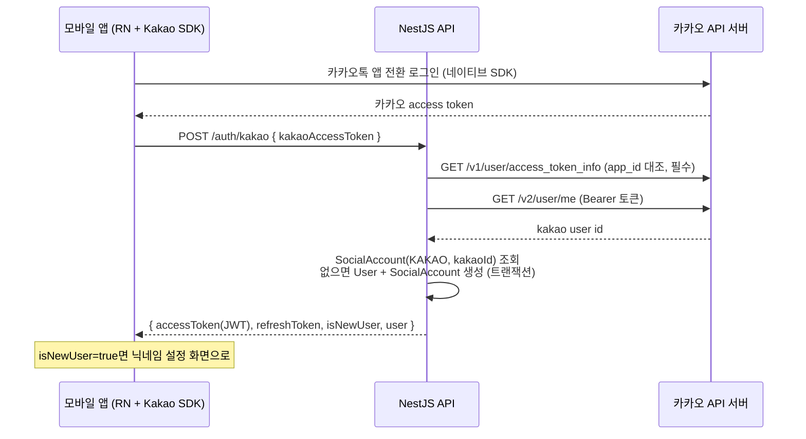
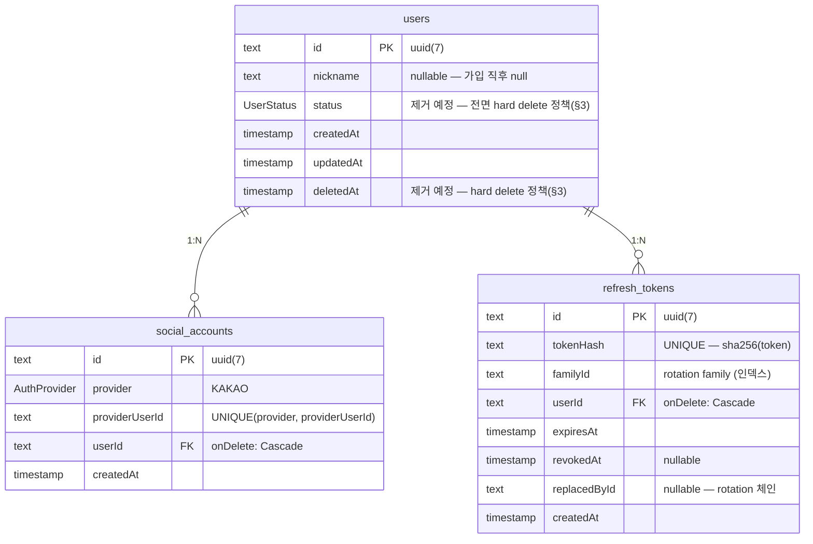
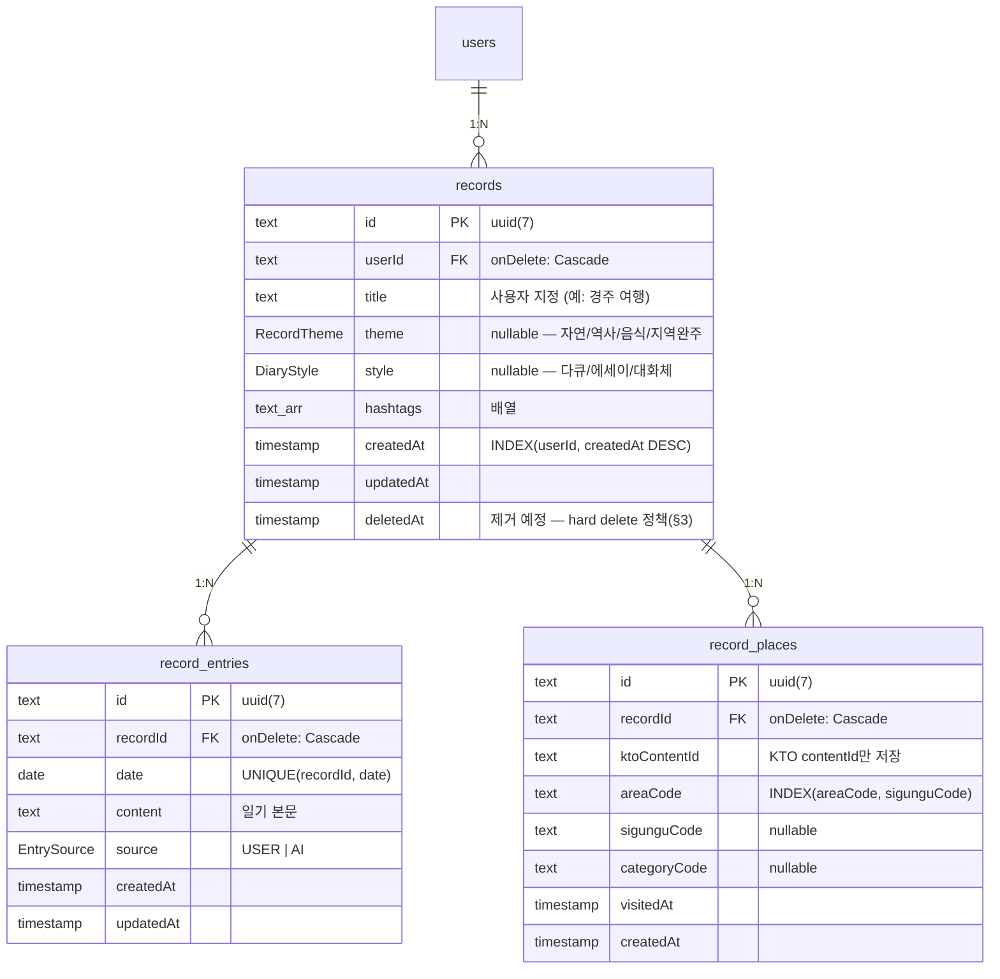

# 카카오 소셜 로그인 인증/DB 설계 (P1 확장)

| 항목      | 내용                                                                                                                                                                                            |
| --------- | ----------------------------------------------------------------------------------------------------------------------------------------------------------------------------------------------- |
| 상태      | auth/users API + 회원탈퇴 구현 완료 (hard delete 전환 포함) · 기록/사진 API 설계 단계                                                                                                           |
| 근거      | [docs/06-architecture.md](./06-architecture.md) §10.4 P1 확장 후보 (PostgreSQL + Prisma)                                                                                                        |
| 디자인    | Figma 로그인 화면 — "카카오로 시작하기" 단일 버튼, AI 기록 생성 설정, 내 여행 기록                                                                                                              |
| 플로우    | Figma Flow — 최초 실행 → 회원가입 여부 → (신규) 닉네임/권한 설정 → 카카오 로그인 → 홈                                                                                                           |
| 핵심 제약 | GPS 좌표·EXIF 원본·KTO 원천 데이터는 서버 DB에 저장하지 않는다                                                                                                                                  |
| 법률 조건 | 방문 관광지(record_places)의 서버 저장·노출은 **위치정보지원센터 사전 검토 후 출시** (§9). 기록 콘텐츠(제목·일기·해시태그)는 대상 아님 — [11-records-api-design.md](./11-records-api-design.md) |

---

## 1. 범위와 원칙

- 소셜 로그인은 **카카오 단독**이다 (구글 미지원 — 디자인/플로우와 일치).
- 서버 DB는 **계정/인증 + 사용자가 직접 확정한 여행 기록**을 저장한다.
  GPS 좌표·EXIF 사진·KTO OpenAPI 원천 데이터는 어떤 테이블에도 저장하지 않는다.
  - 저장하는 것: 기록 제목/테마/문체/해시태그, 날짜별 일기 본문(AI 생성 또는 직접 작성),
    사용자가 확정한 관광지의 KTO `contentId` + 지역/분류 코드 + 방문일.
  - 저장하는 것(선택): **EXIF 등 위치 메타데이터를 제거한 사진 사본** — 기기 변경 시 복원용,
    선택 동의 기반 (계약: [11-records-api-design.md](./11-records-api-design.md) §3.1).
  - 저장하지 않는 것: 사진 원본 및 위치 메타데이터가 포함된 일체의 사진, GPS 위도·경도,
    관광지명/주소/소개/이미지 등 KTO 원천 데이터(화면 표시 시 OpenAPI 실시간 조회).
- Prisma CLI(**v7**)는 글로벌 설치 없이 `apps/api` devDependency로 관리한다.
  실행: `pnpm --filter @tripic/api db:migrate` (루트) 또는 `apps/api`에서 `pnpm prisma <cmd>`.
  - Prisma 7 규칙에 따라 datasource url은 schema가 아닌
    [apps/api/prisma.config.ts](../apps/api/prisma.config.ts)에서 관리한다 (`.env`는 node 내장
    `process.loadEnvFile()`로 로드).
  - client generator는 `prisma-client`(`moduleFormat = "cjs"`, output `src/generated` 미커밋)
    \+ `@prisma/adapter-pg` 조합으로 구성되어 있다 (§10).

## 2. 인증 방식: 카카오 토큰 교환 (Token Exchange)

모바일 앱이 [@react-native-kakao](https://rnkakao.mjstudio.net/) 네이티브 SDK(Expo config plugin, dev client 필요)로
카카오톡 앱 전환 로그인을 수행하고, 발급받은 **카카오 access token을 서버에 전달**한다.
서버는 카카오 API로 토큰을 검증한 뒤 자체 JWT를 발급한다. 서버가 카카오 OAuth
redirect/callback을 처리하지 않으므로 client secret이 필요 없다.



### 검증 규칙 (구현 브랜치 기준)

| 단계                | 카카오 API                                     | 처리                                                                                                                                                                                                 |
| ------------------- | ---------------------------------------------- | ---------------------------------------------------------------------------------------------------------------------------------------------------------------------------------------------------- |
| 토큰 유효성/소속    | `GET kapi.kakao.com/v1/user/access_token_info` | **필수 검증** — 응답 `app_id` ≠ `KAKAO_APP_ID` env → 401. 카카오 user id는 앱별 식별자이므로 타 카카오 앱에서 발급된 유효 토큰(토큰 치환)을 반드시 차단한다. `KAKAO_APP_ID` 미설정 시 서버 부팅 실패 |
| 사용자 식별         | `GET kapi.kakao.com/v2/user/me`                | `id`를 `providerUserId`로 사용                                                                                                                                                                       |
| 카카오 401          | —                                              | `401 Unauthorized` (invalid kakao token)                                                                                                                                                             |
| 카카오 장애/timeout | —                                              | `502 Bad Gateway`, 타임아웃 5초                                                                                                                                                                      |

## 3. 토큰 전략: JWT Access + Refresh Rotation

| 토큰          | 형태                                           | 수명 | 저장                                    |
| ------------- | ---------------------------------------------- | ---- | --------------------------------------- |
| Access Token  | JWT (HS256, payload `{ sub: userId }`)         | 15분 | 서버 미저장 (서명 검증만)               |
| Refresh Token | 불투명 랜덤 토큰 (`randomBytes(48)` base64url) | 30일 | **sha256 해시만** DB 저장 (원문 미저장) |

**Rotation + 재사용 감지**: refresh 사용 시마다 새 토큰으로 교체(rotation)하고, 같은
`familyId`로 체인을 관리한다. 이미 교체/폐기된 토큰이 다시 사용되면 탈취로 간주하고
**해당 family 전체를 즉시 revoke**한다. 로그아웃 시에도 family 전체를 revoke한다.

JWT를 refresh 토큰으로 쓰지 않는 이유: 즉시 폐기(서버 측 무효화)가 필요해서 어차피 DB
조회가 필수이고, 불투명 토큰이 payload 유출 걱정 없이 더 단순하다.

**회원탈퇴와 토큰 무효화 — 전면 hard delete 로 정책 변경** (docs/11 삭제 정책과 통일):

- 탈퇴 = **`users` 행 즉시 삭제** → `onDelete: Cascade`로 social_accounts·refresh_tokens·
  records(일기·사진 포함)까지 일괄 물리 파기. 별도의 토큰 revoke 규칙·`status` 검사·파기
  배치가 모두 불필요해진다.
- 초기 스키마의 `UserStatus`/`status`/`deletedAt`(soft delete 대비용)은 이 결정으로 폐기 —
  마이그레이션 `drop_soft_delete` 로 컬럼·enum 을 제거했고 `status === "ACTIVE"` 검사 코드도
  걷어냈다. 탈퇴 계정의 refresh 토큰은 별도 검사 없이 cascade 로 행이 사라져 401 이 된다.
- access token은 서버 미저장이라 탈퇴 후 최대 15분(TTL) 유효할 수 있다 — 허용 가능한
  트레이드오프. 다만 `/users/me` 등 DB 조회 라우트는 행이 없어 즉시 401이 된다.
- 실수 탈퇴 복구는 지원하지 않는다(유예 기간 없음) — 탈퇴 확인 UX로 대응.

## 4. ERD



### 여행 기록 ERD (Figma: 기록 생성 · AI 기록 생성 설정 · 내 여행 기록)



스키마 원본: [apps/api/prisma/schema.prisma](../apps/api/prisma/schema.prisma)
마이그레이션: `apps/api/prisma/migrations/20260815085742_init_auth_schema/`,
`apps/api/prisma/migrations/20260816121206_add_travel_records/`

## 5. 스키마 결정 근거

| 결정                                                     | 근거                                                                                                                   |
| -------------------------------------------------------- | ---------------------------------------------------------------------------------------------------------------------- |
| `SocialAccount` 별도 테이블 (User에 kakaoId 직저장 대신) | 카카오 단독이지만 `provider` enum + `@@unique([provider, providerUserId])`로 향후 provider 추가 시 스키마 무변경       |
| ID = `uuid(7)`                                           | UUIDv7은 시간 정렬형이라 B-tree 인덱스 친화적, Prisma 네이티브 지원                                                    |
| `nickname` nullable                                      | 온보딩 플로우상 가입 직후엔 없음 → 닉네임 설정 단계(`PATCH /users/me`)에서 채움                                        |
| refresh 토큰 해시 저장                                   | DB 유출 시에도 토큰 원문 노출 없음                                                                                     |
| `familyId` 인덱스                                        | 재사용 감지 시 family 전체 revoke(`updateMany`) 성능                                                                   |
| ~~soft delete (`status` + `deletedAt`)~~ **폐기 결정**   | 전면 hard delete 정책(§3)으로 변경 — 탈퇴·삭제 모두 즉시 물리 파기(cascade). 컬럼은 구현 브랜치에서 제거               |
| role/권한 컬럼 없음                                      | Flow의 "권한 설정"은 기기 권한(사진 접근) 온보딩이지 서버 롤이 아님                                                    |
| `theme`/`style`은 User가 아닌 Record 소속                | "AI 기록 생성 설정" 화면은 기록 생성 플로우의 일부 — 기록마다 다르게 선택 (계정 기본값 필요 시 추후 컬럼 추가)         |
| `RecordEntry` 날짜별 분리 + `UNIQUE(recordId, date)`     | Flow 노트 "날짜별로 묶어서 일기 작성" — 하루 1편, AI/직접 작성 구분(`source`)                                          |
| `RecordPlace`에 코드값만 저장                            | contentId + area/sigungu/category 코드는 KTO 원천 데이터가 아닌 참조 키 — 지역별 조회·시군구 진행률(157) 집계용        |
| 사진 정책                                                | 위치 메타데이터 포함 원본은 미저장 — EXIF 제거 사본만 선택 저장(record_photos, docs/11 §3.1). 원본은 앱 로컬 자산 참조 |
| `hashtags`는 배열                                        | 태그 검색/추천 고도화 전까지 N:M 테이블은 과설계                                                                       |

## 6. 현행 auth/users API 명세 (구현 완료)

| Method | Path            | 인증   | 요청                         | 응답                                                                                  |
| ------ | --------------- | ------ | ---------------------------- | ------------------------------------------------------------------------------------- |
| POST   | `/auth/kakao`   | 공개   | `{ kakaoAccessToken }`       | `201 { accessToken, refreshToken, expiresIn, isNewUser, user: { id, nickname } }`     |
| POST   | `/auth/refresh` | 공개   | `{ refreshToken }`           | `200 { accessToken, refreshToken, expiresIn }` / 재사용 감지 시 `401` + family revoke |
| POST   | `/auth/logout`  | Bearer | `{ refreshToken }`           | `204` (family 전체 revoke)                                                            |
| GET    | `/users/me`     | Bearer | —                            | `200 { id, nickname, createdAt }`                                                     |
| PATCH  | `/users/me`     | Bearer | `{ nickname }` (trim 2–20자) | `200 { id, nickname }`                                                                |

- 전역 guard(default-deny) + `@Public()` 데코레이터 방식. 기존 운영 API
  (health/app-config/notices/version)는 `@Public()` 유지.

### 회원탈퇴 (구현 완료)

| Method | Path        | 인증   | 요청 | 응답                                                   |
| ------ | ----------- | ------ | ---- | ------------------------------------------------------ |
| DELETE | `/users/me` | Bearer | —    | `204` — `users` 행 hard delete (cascade 일괄 파기, §3) |

- 탈퇴 확인은 앱 UX(다이얼로그)에서 처리 — 서버는 삭제만 수행한다. 이미 없는 사용자의
  남은 access token 으로 다시 호출하면 `401`.
- 같은 카카오 계정으로 다시 로그인하면 소셜 계정 행도 사라진 상태라 **신규 가입**으로 처리된다
  (`isNewUser: true`, 새 user id, 닉네임 null).
- 응답 후 앱은 저장된 토큰을 폐기한다. 서버 측 refresh 토큰은 cascade로 이미 소멸.
- 카카오 unlink(admin API, `KAKAO_ADMIN_KEY`)는 후속 검토 — 미연동 시 사용자가 카카오
  계정 설정에서 직접 연결 해제 가능함을 안내.
- ⚠️ **디자인 공백**: 현재 Figma 설정 화면(46:1245)에는 회원탈퇴 진입점이 없다 — 앱스토어
  심사는 계정 생성이 있는 앱에 **계정 삭제 기능을 요구**하므로 설정 화면에 탈퇴 항목 추가가
  필요하다 (디자인 반영 요청).
- 출시 체크리스트: Google Play는 앱 내 삭제 외에 **앱 미설치 상태에서도 삭제를 요청할 수 있는
  외부 웹 리소스 URL**을 함께 요구한다
  ([Play 정책](https://support.google.com/googleplay/android-developer/answer/13327111)) —
  Notion 페이지 + 접수 이메일로 충족 가능 (심사 제출 전 준비).
- 요청 검증은 zod (`packages/shared/src/schemas/`에 스키마 배치 — 모바일과 공유).

## 7. 환경 변수

| 변수                   | 용도                                     | 상태 |
| ---------------------- | ---------------------------------------- | ---- |
| `DATABASE_URL`         | PostgreSQL 접속 문자열                   | 사용 |
| `JWT_ACCESS_SECRET`    | JWT 서명 키 (32자 이상)                  | 사용 |
| `JWT_ACCESS_TTL_SEC`   | access token 수명 (기본 900)             | 사용 |
| `JWT_REFRESH_TTL_DAYS` | refresh token 수명 (기본 30)             | 사용 |
| `KAKAO_APP_ID`         | access_token_info의 app_id 대조용 (필수) | 사용 |

`/app-config` 응답값도 환경변수로 덮을 수 있다 (전부 선택, 기본값은 코드에 있음) —
`KTO_DEFAULT_RADIUS_M`·`KTO_MAX_RADIUS_M`·`KTO_MAX_CANDIDATES`·`FEATURE_AI_DIARY`·
`FEATURE_PHOTO_UPLOAD`. 상세는 [13-operations-api-design.md](./13-operations-api-design.md) §2.

`KAKAO_ADMIN_KEY`는 현재 불필요 — 회원탈퇴 시 서버 측 unlink(admin API)를 도입할 때만 필요.
템플릿: [apps/api/.env.example](../apps/api/.env.example)

## 8. 로컬 개발 / 마이그레이션 워크플로

```bash
# 1. DB 기동 (레포 루트, 호스트 포트 48291 — 로컬 5432 점유와 충돌 회피)
docker compose up -d db

# 2. env 준비
cp apps/api/.env.example apps/api/.env

# 3. 마이그레이션 (스키마 변경 시)
# 주의: pnpm은 `--`를 그대로 전달하고 prisma는 `--` 이후 플래그를 무시하므로 `--` 없이 쓴다
pnpm --filter @tripic/api db:migrate --name <change_name>

# 4. 상태 확인 (apps/api 디렉터리에서)
pnpm prisma migrate status
```

### 8.1 프로덕션 릴리스 (자동)

런타임 이미지에는 prisma CLI를 넣지 않는다. 대신 [apps/api/Dockerfile.migrate](../apps/api/Dockerfile.migrate)가
prisma CLI + `prisma/migrations`만 담은 일회성 이미지를 만들고, 이것을 Northflank Job으로 실행한다.
실 DB 접속은 Northflank 내부 네트워크에서만 일어나므로 DB를 인터넷에 노출하지 않는다.

`apps/api/Dockerfile`과 스테이지를 공유하지 않으므로(`COPY --from` 없음) 파일을 나눴다.
한 파일에 두면 "마지막 스테이지 = 기본 target"이라 target을 빠뜨린 빌드가 엉뚱한 이미지를 만든다.
두 파일의 base image 핀이 갈라지지 않도록 CI의 `Verify base image pin` 스텝이 강제한다.

**배포 순서는 GitHub이 아니라 Northflank 템플릿이 보장한다.**
[apps/api/northflank.json](../apps/api/northflank.json)이 GitOps로 Northflank 템플릿과 양방향 동기화되며,
`v*` 태그를 push하면 [server-publish.yml](../.github/workflows/server-publish.yml)이 다음을 수행한다:

```txt
publish → api / migrator 이미지를 GHCR에 push (태그가 아닌 digest로 고정)
release → POST /v1/templates/{id}/runs 로 템플릿 실행 + 결과까지 폴링
             ManualJob            마이그레이션 job 정의(이미지 = ${args.migratorImage})
             JobRun               prisma migrate deploy 실행
             Condition(success)   완료·성공까지 대기
             DeploymentService    api 서비스 이미지를 ${args.apiImage}로 patch
```

`Condition`이 실패하면 `DeploymentService` 노드가 실행되지 않아 구 버전 앱이 그대로 서비스된다.
이미지를 태그가 아닌 digest로 넘기므로, 적용된 SQL과 배포된 앱이 같은 커밋임이 보장된다.

**Northflank 사전 설정**

- 템플릿: GitOps를 켜고 레포 `Remember-In/Tripic`, 브랜치 `main`, 파일 `/apps/api/northflank.json`을
  연결한다. 동기화는 양방향이므로 UI에서 노드를 고치면 레포에 커밋되고, 레포에 push하면 템플릿이 갱신된다.
  **auto-run은 끈다** — 릴리스는 태그 워크플로가 argument(digest)를 넘겨 실행해야 하고,
  템플릿 파일이 바뀔 때마다 배포가 돌면 안 된다.
- 마이그레이션 job의 `DATABASE_URL`은 템플릿에 넣지 않는다(레포에 커밋되므로). Northflank에서
  Managed Postgres secret group을 job에 연결한다. **UI에서 job에 직접 env 변수를 넣지 말 것** —
  `ManualJob` 노드가 `updateMode: "put"`(전체 교체) + `"runtimeEnvironment": {}` 이라 다음 템플릿
  실행 때 지워진다. secret group 연결은 job spec 밖의 링크라 유지된다.
- api 서비스: 템플릿의 `DeploymentService` 노드는 `updateMode: "patch"` 라 **기존 서비스를 찾아
  이미지만 교체한다 — 서비스를 만들지는 않는다.** 이름이 정확히 `tripic-api` 인 deployment service를
  먼저 만들어 두어야 하고, 없으면 그 노드가 `Service not found` 로 실패한다.
  포트 3000/HTTP, health probe `GET /health`, secret group `tripic-secrets` 연결,
  그리고 **자동 배포(auto-deploy)는 끈다** — 켜져 있으면 마이그레이션 완료 전에 새 이미지가 뜰 수 있다.
- 서비스 필수 환경변수는 [src/config/env.ts](../apps/api/src/config/env.ts) 의 zod 스키마가 부팅 시
  강제한다: `DATABASE_URL`, `JWT_ACCESS_SECRET`(32자 이상), `KAKAO_APP_ID`(양의 정수).
  나머지(`JWT_ACCESS_TTL_SEC`·`JWT_REFRESH_TTL_DAYS`·`PORT`)는 기본값이 있다.
- GHCR 패키지는 public으로 둔다(레포가 공개이므로 이미지만 숨길 실익이 없다). 그래서 템플릿에
  registry credentials를 넣지 않는다. private으로 바꾸면 각 external 이미지에 `credentials`를 추가해야 한다.
- `options.concurrencyPolicy`는 `queue`로 둔다. Northflank 기본값 `allow`면 릴리스가 겹칠 때
  마이그레이션이 동시에 돌 수 있다(워크플로의 concurrency group은 UI에서 수동 실행한 run을 막지 못한다).
- `billing.deploymentPlan`은 `nf-compute-20`(계정에서 사용 가능 확인됨). 더 작은 건 `nf-compute-10`
  뿐인데 Node + Prisma CLI가 뜨는 job이라 RAM이 빠듯할 수 있어 내리지 않는다. 플랜 목록은:

  ```bash
  # /v1/plans 는 인증 없이 열려 있다 — 여기서 200이 나와도 API 토큰 검증과는 무관하다.
  curl -sS https://api.northflank.com/v1/plans \
    | jq -r '.data.plans[] | "\(.id)\t\(.cpuResource)vCPU\t\(.ramResource)MB"'
  ```

**GitHub 설정** — `production` environment(승인자 지정 권장)에 아래를 둔다.

| 종류     | 이름                     | 값                  |
| -------- | ------------------------ | ------------------- |
| secret   | `NORTHFLANK_API_TOKEN`   | Northflank API 토큰 |
| variable | `NORTHFLANK_TEMPLATE_ID` | 템플릿 ID           |

**파일 소유권은 Northflank에 있다** — GitOps 동기화가 양방향이라 템플릿을 UI에서 저장하면
`northflank-cloud-build-run[bot]`이 이 파일을 직접 커밋한다. 봇은 `$schema`·`options`·`gitops`
블록과 노드 기본값(`updateMode`, `buildConfiguration`, `runtimeEnvironment`, `buildArguments`)을
채워 넣고 파일 끝 개행 없이 쓴다. pre-commit의 `*.json` prettier와 왕복 churn이 나므로
[.prettierignore](../.prettierignore)에서 제외했다 — `pnpm format`을 돌려도 이 파일은 건드리지 않는다.

**스키마 검증 주의** — `https://api.northflank.com/v1/schemas/template`으로 IDE 검증이 되지만
스키마 자체에 결함이 있다. `Condition` 노드의 `runId`는 oneOf 브랜치가 "제약 없는 string"과
"`${...}` 패턴" 둘이라 어떤 참조값이든 양쪽에 매치돼 strict 검증에서 실패한다(`anyOf`여야 맞다).
Northflank 실제 검증은 통과하므로 이 경고는 무시한다.

**마이그레이션 작성 제약** — `migrate deploy`는 롤백하지 않는다. 컬럼 DROP·NOT NULL 추가 등
파괴적 변경은 expand/contract로 나눠 별도 릴리스에 싣는다. 이미 적용된 마이그레이션 파일을
수정하면 checksum 불일치로 배포가 실패한다(의도된 안전장치 — 새 마이그레이션을 추가할 것).
데이터가 쌓인 뒤에는 템플릿의 `JobRun` 앞에 `AddonBackup`(Run backup) 노드를 넣어
마이그레이션 직전 백업을 남기는 것을 검토한다.

## 9. 위치정보 법률 검토 (기록 서버 저장의 출시 조건)

계정별 방문 기록의 서버 저장은 PRD([08-privacy-risk.md](./08-privacy-risk.md))가 명시한 대로
**위치정보지원센터 공식 사전 검토 후 출시**한다. 법령 조사와 데이터 흐름별 판단·상담 계획은
[12-location-law.md](./12-location-law.md)에 정리했다. 검토 요청 시 논거:

- 기기에서 수집된 **GPS 좌표(EXIF 포함)는 서버로 전송·저장하지 않는다** — 기존 원칙 유지.
- 서버에 저장되는 것은 사용자가 화면에서 **직접 선택·확정한 관광지의 KTO contentId와 방문일**뿐이다.
  이는 통신설비로 자동 수집된 위치정보가 아니라 SNS 체크인과 유사한 자기 선언 콘텐츠 성격이다.
- 좌표 정밀도가 아닌 관광지/지역 코드 단위이며, 실시간 위치가 아닌 과거 방문 기록이다.

검토 대상은 **방문 관광지(record_places)에 한정**된다 — 기록 콘텐츠(제목·테마·문체·해시태그·일기)는
일반 사용자 콘텐츠로 위치정보법 대상이 아니어서 검토와 무관하게 서버 저장/노출 가능하다
([11-records-api-design.md](./11-records-api-design.md) §1).

검토 결과가 나오기 전까지: 스키마/마이그레이션은 준비하되, record_places 관련 API의 **프로덕션 노출은 보류**한다.
검토에서 제약이 확인되면 record_places 테이블 도입을 재설계한다.

## 10. 후속 브랜치 체크리스트 (`feat/auth-kakao-api`) — 완료

구현은 [apps/api/CLAUDE.md](../apps/api/CLAUDE.md)의 원칙(TDD·경량 헥사고날 ports & adapters·SOLID)을 따랐다.

- [x] Prisma 7 `prisma-client` generator 추가 (output `src/generated`, `moduleFormat = "cjs"`, 미커밋)
      \+ `@prisma/client` 런타임 + `@prisma/adapter-pg` 의존성, CI lint/test/e2e job에 generate step
- [x] ConfigModule + zod env 검증(`src/config/env.ts`), `main.ts` `enableShutdownHooks()`
- [x] PrismaModule/PrismaService — `new PrismaClient({ adapter: new PrismaPg({ connectionString }) })`
- [x] AuthModule — `ports/`(KakaoVerifier·AuthAccounts·RefreshTokens) + `adapters/`(kakao-api fetch,
      prisma-\*), 전역 JwtAuthGuard + `@Public()`, rotation은 어댑터 트랜잭션으로 원자성 보장
- [x] `KAKAO_APP_ID` env 필수화 — 미설정 시 부팅 실패, app_id 불일치 시 401 (타 앱 토큰 차단)
- [x] 전면 hard delete 전환 — `status`/`deletedAt` 제거, `DELETE /users/me`에서 계정 연관
      데이터를 cascade 파기하고 남은 토큰의 사용자 조회를 차단
- [x] UsersModule (`GET/PATCH/DELETE /users/me`, 닉네임 온보딩·회원탈퇴)
- [x] 단위 테스트(포트 in-memory fake) + e2e(**Testcontainers** Postgres + PactumJS, 카카오 port stub)
- [x] Dockerfile: shared build → `prisma generate` → `nest build` — Prisma 7은 엔진 바이너리가 없어
      6에서 우려했던 `pnpm deploy` 재생성 핵과 alpine musl `binaryTargets` 이슈가 사라짐

남은 것: 사진 업로드·AI 일기 API와 방문 관광지 API(위치정보지원센터 검토 후). 여행 기록
콘텐츠 API는 [11-records-api-design.md](./11-records-api-design.md)의 사진·방문지 제외 범위로
구현 완료했다.
