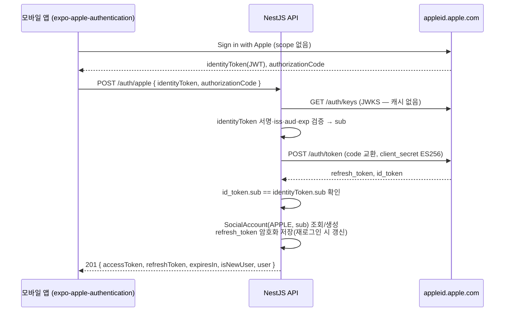
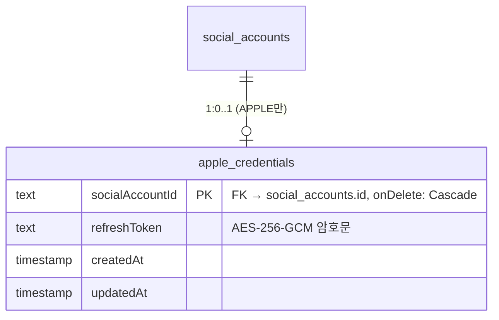

# Sign in with Apple 인증 설계 (P1 확장)

| 항목      | 내용                                                                                                                         |
| --------- | ---------------------------------------------------------------------------------------------------------------------------- |
| 상태      | 서버 API 구현 (`feat/api-apple-login`) · 모바일 Apple 버튼은 후속 작업                                                       |
| 근거      | App Store 심사 대응 — Guideline 4.8(로그인 서비스), 5.1.1(v)(계정 삭제), TN3194(토큰 revoke), 2026 한국 개발자 알림 요구사항 |
| 선행 문서 | [10-auth-db-design.md](./10-auth-db-design.md) — 토큰 전략·hard delete 정책은 카카오와 동일하게 공유한다                     |
| 핵심 제약 | 서버는 **캐시를 두지 않는다** — Apple 공개키(JWKS)는 검증마다 조회하고, client_secret은 호출마다 새로 서명한다               |

---

## 1. 도입 배경

- **Guideline 4.8** — 계정을 만들거나 인증할 때 제3자 소셜 로그인(카카오)만 제공하면, 이름·이메일 외
  데이터를 수집하지 않고 이메일 비공개를 허용하는 **동등한 로그인 수단**을 함께 제공해야 한다.
  Sign in with Apple을 추가해 충족한다.
- **계정 삭제 시 토큰 revoke** — Sign in with Apple을 쓰는 앱이 앱 안에서 계정을 삭제하면
  서버가 Apple REST API로 토큰을 폐기해야 한다
  ([TN3194](https://developer.apple.com/documentation/technotes/tn3194-handling-account-deletions-and-revoking-tokens-for-sign-in-with-apple)).
- **server-to-server 알림 endpoint** — 2026-01-01부터 한국 개발자는 Services ID를 등록·수정할 때
  알림 endpoint 제출이 필수다
  ([Apple 공지, 2025-10-09](https://developer.apple.com/news/?id=j9zukcr6)). Tripic은 웹 로그인이 없어
  Services ID를 쓰지 않지만, 사용자가 Apple 설정에서 **연결을 끊거나 Apple 계정을 삭제한 사실**을
  서버에 반영하려면 필요하므로 App ID에 endpoint를 등록한다.

## 2. 범위와 원칙

- provider는 **카카오 + Apple** 두 가지다. 계정 연결(한 사용자에 여러 provider)은 지원하지 않는다 —
  같은 사람이라도 카카오와 Apple로 각각 가입하면 **별개의 사용자**다.
- 앱은 Apple에 **이메일·이름 scope를 요청하지 않는다.** 서버는 Apple 사용자 식별자(`sub`)만 저장한다.
- 토큰 발급(access JWT + refresh rotation)과 탈퇴 hard delete는 카카오와 같은 경로를 쓴다
  ([10-auth-db-design.md](./10-auth-db-design.md) §3).
- Apple refresh token은 탈퇴 시 revoke에 필요하므로 **AES-256-GCM으로 암호화해 DB에 저장**한다 (§5).

## 3. 로그인: `POST /auth/apple`

앱이 네이티브 Apple 로그인 시트(`expo-apple-authentication`)로 받은 `identityToken`과
`authorizationCode`를 서버로 보낸다. 서버는 identity token을 검증하고, authorization code를
Apple에 교환해 refresh token을 받아 저장한 뒤 Tripic 세션을 발급한다.

### 3.1 검증 규칙

| 단계               | 처리                                                                                                                                                             |
| ------------------ | ---------------------------------------------------------------------------------------------------------------------------------------------------------------- |
| 요청 형식          | `{ identityToken: string(1+), authorizationCode: string(1+) }` — 위반 시 `400`                                                                                   |
| 공개키             | `GET https://appleid.apple.com/auth/keys` 를 **검증마다** 조회해 JWS 헤더 `kid`와 일치하는 키 사용. 일치 키 없음 → `401`                                         |
| identity token     | 알고리즘 `RS256` 고정, `iss = https://appleid.apple.com`, `aud = APPLE_CLIENT_ID`(bundle id), `exp` 미경과. 하나라도 위반 → `401`                                |
| authorization code | `POST https://appleid.apple.com/auth/token` (`grant_type=authorization_code`). `invalid_grant`(만료 5분·재사용) → `401`, 그 외 오류(`invalid_client` 등) → `502` |
| 사용자 일치        | 교환 응답 `id_token`의 `sub` ≠ identity token `sub` → `401` (다른 사용자의 code 끼워넣기 차단). code는 1회용이라 재전송 공격도 막힌다                            |
| 사용자 식별        | `sub`를 `providerUserId`로 사용                                                                                                                                  |
| Apple 장애/timeout | `502 Bad Gateway`, 타임아웃 5초 (카카오와 동일)                                                                                                                  |

### 3.2 client_secret

Apple REST API(`/auth/token`, `/auth/revoke`)의 `client_secret`은 개발자 키(.p8)로 서명한 JWT다.
**호출마다 새로 서명**하고 수명은 5분으로 짧게 둔다(캐시하지 않음).

| 위치    | 값                                                         |
| ------- | ---------------------------------------------------------- |
| header  | `alg: ES256`, `kid: APPLE_KEY_ID`                          |
| payload | `iss: APPLE_TEAM_ID`, `sub: APPLE_CLIENT_ID`               |
| payload | `aud: https://appleid.apple.com`, `iat`, `exp = iat + 300` |

## 4. 서버 알림(webhook): `POST /auth/apple/notifications`

Apple이 사용자 계정 상태 변화를 서버로 직접 알린다. `@Public()` 이며 인증은 **Apple 서명 검증**으로 한다.

- 요청 body: `{ "payload": "<JWS>" }` — 형식 위반 시 `400`
- 검증: 로그인과 같은 JWKS·`RS256`·`iss`·`aud = APPLE_CLIENT_ID`. 실패 시 `401`, JWKS 조회 실패 시 `502`(Apple이 재시도)
- `events` claim은 JSON 문자열 또는 객체로 올 수 있어 둘 다 받는다 — `{ type, sub, event_time, email?, is_private_email? }`
- 성공 응답은 `200` (본문 없음). 모든 처리는 **멱등**이다 — 같은 알림이 중복 도착해도 결과가 같다.

| `events.type`                        | 처리                                                                                                                                                                                                |
| ------------------------------------ | --------------------------------------------------------------------------------------------------------------------------------------------------------------------------------------------------- |
| `consent-revoked`                    | 사용자가 Apple 설정에서 Tripic 연결을 끊음 → 해당 사용자의 **Tripic refresh token 전부 revoke** + `apple_credentials` 행 삭제. 계정·기록은 유지하고, 다시 Apple로 로그인하면 같은 계정으로 들어온다 |
| `account-delete` / `account-deleted` | Apple 계정 영구 삭제 → 회원탈퇴와 같은 **hard delete**. Apple 토큰은 이미 무효라 revoke를 호출하지 않는다                                                                                           |
| `email-enabled` / `email-disabled`   | 이메일을 저장하지 않으므로 무시                                                                                                                                                                     |
| 그 외 type                           | 무시 (향후 추가 이벤트 호환)                                                                                                                                                                        |
| 모르는 `sub`                         | 무시 (이미 탈퇴한 사용자 등)                                                                                                                                                                        |

access token은 서버 미저장이라 `consent-revoked` 후에도 최대 15분 유효할 수 있다 — 탈퇴와 같은 트레이드오프
([10-auth-db-design.md](./10-auth-db-design.md) §3).

## 5. Apple refresh token 저장

provider 공통 식별 정보(`provider`, `providerUserId`)는 `social_accounts`에 두고, **Apple에만 필요한 자격 증명은
`apple_credentials`에 분리**한다. 카카오 계정에는 쓰지 않는 nullable 컬럼을 만들지 않고, 암호문을 조회하는 경로를
탈퇴 revoke 한 곳으로 좁히기 위해서다. 가입·로그인 조회는 기존 `social_accounts` 경로를 그대로 쓴다.

| 항목      | 내용                                                                                                                        |
| --------- | --------------------------------------------------------------------------------------------------------------------------- |
| 테이블    | `apple_credentials` — `socialAccountId`(PK·FK → `social_accounts`, cascade), `refreshToken`(text), `createdAt`, `updatedAt` |
| 암호화    | AES-256-GCM, 요청마다 12바이트 랜덤 IV                                                                                      |
| 저장 형식 | `v1.<iv>.<authTag>.<ciphertext>` (각 base64url) — `v1` 은 키 교체 시 버전 구분용                                            |
| 키        | `SOCIAL_TOKEN_ENCRYPTION_KEY` — base64로 인코딩한 32바이트. 길이가 다르면 부팅 실패                                         |
| 갱신      | 같은 Apple 계정으로 다시 로그인하면 새 refresh token으로 덮어쓴다                                                           |
| 삭제      | 탈퇴·Apple 계정 삭제 시 `users` → `social_accounts` → `apple_credentials` cascade 파기, `consent-revoked` 시 행 삭제        |

키를 교체해야 하면 새 버전 접두사(`v2`)와 복호화 fallback을 먼저 배포한 뒤 재암호화한다. 현재는 `v1` 한 가지다.

## 6. 회원탈퇴: `DELETE /users/me` 변경

탈퇴 순서가 **Apple revoke → users 행 삭제**로 바뀐다. 계약(`204`)은 그대로다.

| 상황                                                        | 처리                                                                                                   |
| ----------------------------------------------------------- | ------------------------------------------------------------------------------------------------------ |
| 카카오 계정                                                 | 기존과 동일하게 즉시 삭제 (카카오 unlink는 [10](./10-auth-db-design.md) §6대로 후속 검토)              |
| Apple 계정 + 저장된 토큰 있음                               | 복호화 → `POST https://appleid.apple.com/auth/revoke` (`token_type_hint=refresh_token`) → 성공 시 삭제 |
| Apple이 토큰 무효로 응답(`invalid_grant`)                   | 이미 폐기된 것으로 보고 삭제 진행                                                                      |
| Apple 계정 + `apple_credentials` 없음(`consent-revoked` 후) | revoke 생략하고 삭제                                                                                   |
| Apple 장애/timeout                                          | **`502`, 삭제하지 않음** — 앱은 원격 삭제 실패 시 로컬 데이터를 보존하므로 사용자가 재시도한다         |
| 토큰 복호화 실패(키 설정 오류)                              | `500`, 삭제하지 않음 — 운영자가 키 설정을 바로잡아야 하는 장애로 취급한다                              |

## 7. 환경 변수

모두 **필수**다. 미설정·형식 오류 시 서버 부팅이 실패한다 ([src/config/env.ts](../apps/api/src/config/env.ts)).

| 변수                          | 용도                                                                            |
| ----------------------------- | ------------------------------------------------------------------------------- |
| `APPLE_CLIENT_ID`             | App ID bundle id (`com.tripic.app`) — identity token `aud`, client_secret `sub` |
| `APPLE_TEAM_ID`               | Apple Developer Team ID — client_secret `iss`                                   |
| `APPLE_KEY_ID`                | Sign in with Apple 키의 Key ID — client_secret `kid`                            |
| `APPLE_PRIVATE_KEY`           | 해당 키의 .p8 PEM 전문. 한 줄 env면 줄바꿈을 `\n` 으로 넣는다                   |
| `SOCIAL_TOKEN_ENCRYPTION_KEY` | Apple refresh token 암호화 키 — `openssl rand -base64 32`                       |

## 8. Apple Developer 설정 (runbook)

1. **Identifiers → App ID `com.tripic.app`** → Capabilities에서 **Sign in with Apple** 체크 →
   _Enable as a primary App ID_ → **Configure** → Server-to-Server Notification Endpoint에
   `https://tripic.remin.dev/auth/apple/notifications` 입력 (HTTPS·TLS 1.2+ 절대 URL).
2. **Keys → +** → **Sign in with Apple** 체크 → Configure에서 primary App ID `com.tripic.app` 선택 →
   등록 후 **.p8을 즉시 다운로드**(재다운로드 불가) → Key ID 기록.
3. **Membership details**에서 Team ID 확인.
4. Northflank `tripic-secrets` secret group에 §7 변수 5개를 추가한다. **변수 추가가 이 기능을 담은 릴리스보다
   먼저**여야 한다 — 누락되면 새 이미지가 부팅에 실패한다.
5. 프로비저닝 프로파일은 EAS가 capability 변경을 반영해 재생성한다(모바일 작업 시 확인).

## 9. 모바일 연동 계약 (후속 작업 참고)

- `expo-apple-authentication` 설치, `app.json` `ios.usesAppleSignIn: true`.
- `AppleAuthentication.signInAsync({ requestedScopes: [] })` → `identityToken`·`authorizationCode`를
  `appleLoginSchema`(`@tripic/shared`)로 검증해 `POST /auth/apple`에 보낸다. 응답은 `socialLoginResultSchema`.
- 로그인 화면은 Apple HIG에 맞는 공식 버튼(`AppleAuthenticationButton`)을 카카오 버튼과 **동등한 크기·위치**로 둔다(4.8).
- `GET /users/me` 응답의 `provider`로 설정 화면의 "카카오/Apple 계정으로 로그인됨"을 구분한다.

## 10. 체크리스트

- [x] 설계 문서(이 문서)와 10·07·법무 문서 갱신
- [ ] `AuthProvider.APPLE` + `apple_credentials` 테이블 마이그레이션
- [ ] `POST /auth/apple` — JWKS 검증, code 교환, sub 일치, 토큰 암호화 저장
- [ ] `POST /auth/apple/notifications` — 서명 검증, `consent-revoked`·`account-delete` 처리
- [ ] `DELETE /users/me` — Apple revoke 선행, 실패 시 502
- [ ] 단위 테스트(어댑터 fetch stub, 서비스 in-memory fake) + e2e(Apple 포트 stub)
- [ ] Apple Developer 설정(§8)과 Northflank secret 등록
- [ ] 모바일 Apple 버튼 연동 후 TestFlight에서 로그인·탈퇴 revoke·알림 수신 실기기 확인
